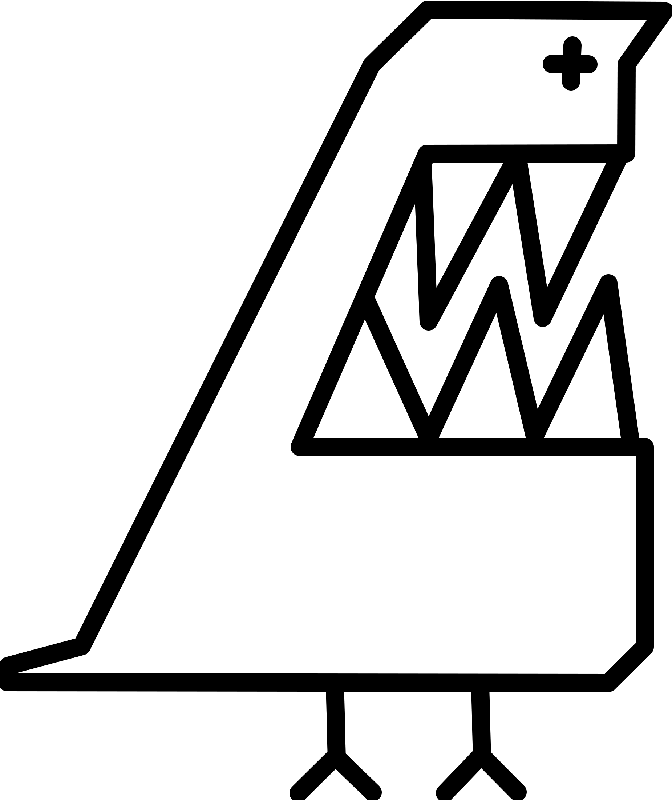
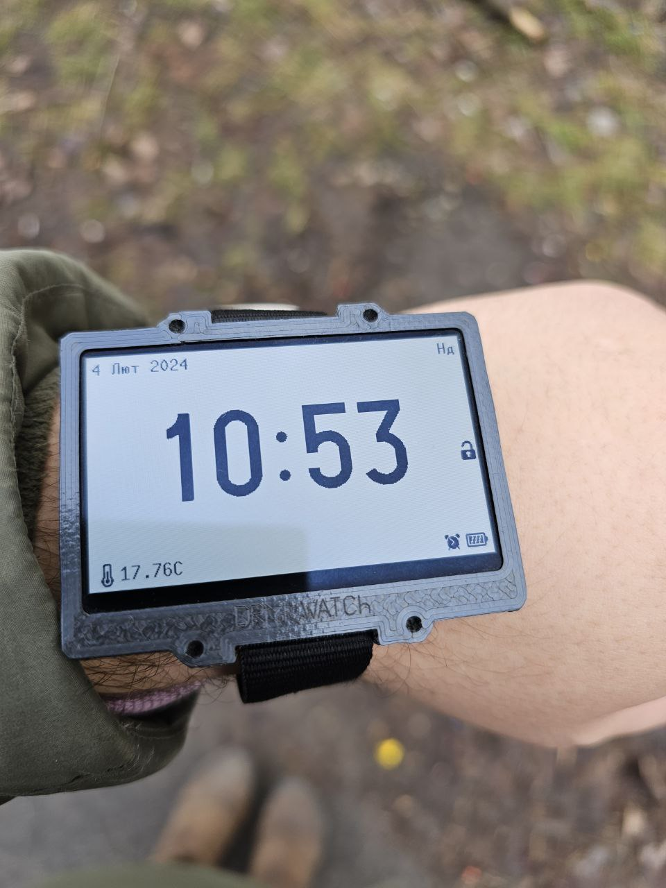
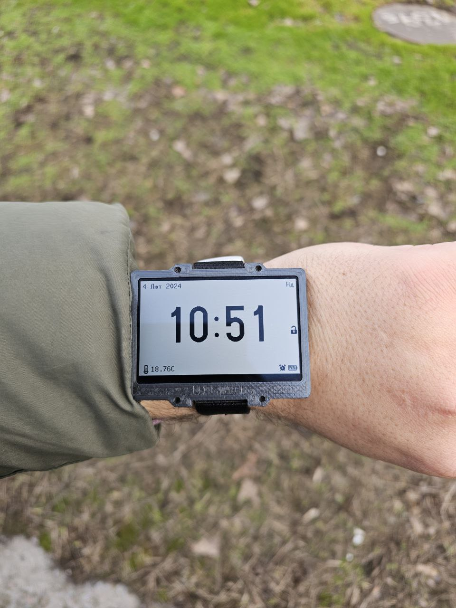

<!-- For new line: \ -->
<!-- Picture:   -->

# Про проект DRM Watch v3
Наручний годинник на базі ESP32-S2 та SHARP Memory LCD.
А все починалось з того, що мені сподобався дисплей...

## Особливості годинника
- Стабільно працює і підходить для щоденного користування.
- Дисплей завжди показує час;
- Акумулятора вистачає на понад 20днів;
- Зручні меню, звідки можна отримати доступ до всіх функцій;
- Наявність Wi-Fi, можна зберегти до 8 мереж в пам'яті;
- Можливість синхронізації часу по Wi-Fi;
- Багато мелодій. Їх можна або просто слухати або встановити на будильник.
- Мявчання кошенят;
- Кілька циферблатів, які можна налаштувати;
- Секундомір;
- Будильник;
- Календар;
- Зарядка по USB;
- Можна оновлювати прошивку по USB, не розбираючи годинник.
- Є індикатор заряду;
- Компоненти для збірки легко дістати;
- Корпус підходить для стандартних 20мм ремінців;
- Якщо під час експериментів з прошивками годинник завис, в корпусі передбачено отвір щоб голкою його перезавантажити.
- Водонепроникність до 0 метрів:) (можна трохи покращити якщо при збірці обробити плату лаком а корпус збирати з клеєм.)
- Годинник можна використовувати як поле для експериментів з ESP32-S2: акумулятор, 3 кнопки, пищалка, дисплей, 3 світлодіоди;
- Екран "Про годинник" містить інформацію про розробника та версію прошивки.

## Де брати комплектуючі

 

### Дисплей

 

Дисплей потрібен, щоб відображати інформацію користувачу:)
Модель дисплея: Sharp LS027B7DH01A 
Він звісно недешений, але мені дуже подобається як він виглядає
Його можна купити готовим, я купував тут: 
(посилання актуальне станом на 2024-04) https://www.aliexpress.us/item/1005005611440829.html

### Буззер

 

Буззер потрібен щоб пищати, грати мелодії.  
Модель: Buzzer SMD 7525-3.6V-passive  
Я купував тут:  
(посилання актуальне станом на 2024-04) https://www.aliexpress.us/item/1005003620083880.html
(посилання актуальне станом на 2024-04) https://eu.mouser.com/ProductDetail/CUI-Devices/CMT-7525S-SMT-TR?qs=qCxwlXJ4fnw4ZHFvNib47A%3D%3D

### Конектор дисплея

### ESP32

 

Я розпаював на комплектуючі плати Lolin S2 Mini, ось ссилка де я купував:
(посилання актуальне станом на 2024-04) https://www.aliexpress.us/item/1005004438665554.html

Якщо немає бажання розпаювати, можна купити комплектуху окремо:
Чіп: ESP32-S2, QFN56
(посилання актуальне станом на 2024-04) https://www.tme.eu/en/details/esp32s2/iot-wifi-bluetooth-modules/espressif/esp32-s2/
(посилання актуальне станом на 2024-04) https://eu.mouser.com/ProductDetail/Espressif-Systems/ESP32-S2?qs=GBLSl2Akirtmlui%2FgtDaSQ%3D%3D

Кварц: SMD 3225 4pin 40MHz:

 

(посилання актуальне станом на 2024-04) https://www.aliexpress.us/item/1005004689346275.html

  

##Процес збірки та налагодження
Мені дуже допомогла в пайці така прикольна паяльна станція:

 

https://www.aliexpress.us/item/1005005609080807.html

На етапі налагодження може допомогти такий Breakout Board який підійде для ESP32-S2 (нагадую, там корпус QFN56)

 

https://www.aliexpress.us/item/1005002805132028.html

## Tools used:
- KiCad 7
- Arduino IDE 2.2.1
- esp32 by Espressif v2.0.11, ESP32-S2 (Select "Lolin S2 Mini" board to flash successfully)
- LCD Assistant

## How to add own melodies:
To make melodies I used tool by ShivamJoker which I modified to generate my melody format.
Use tool in Software\MIDI-to-Arduino-main. 
Add melody array to MelodyPlayer.ini file and add melody to melodies array.

## Known libraries conflicts:
Temperature measurement is hanging system if after Wi-Fi usage it were not initialized.

##Steel Marking Process:
https://youtube.com/shorts/PZIMB8fdEP8?si=xofTaj4oOFBRnQQU

## References

- Big repository of phone melodies where I found some melodies
http://onj3.andrelouis.com/phonetones/unzipped/

##Історія проекту
- 2023 рік, я десь наткнувся на відео про sharp memory lcd зрозумів, що дуже хочу собі такий дисплей. Замовив на алі.
- 

