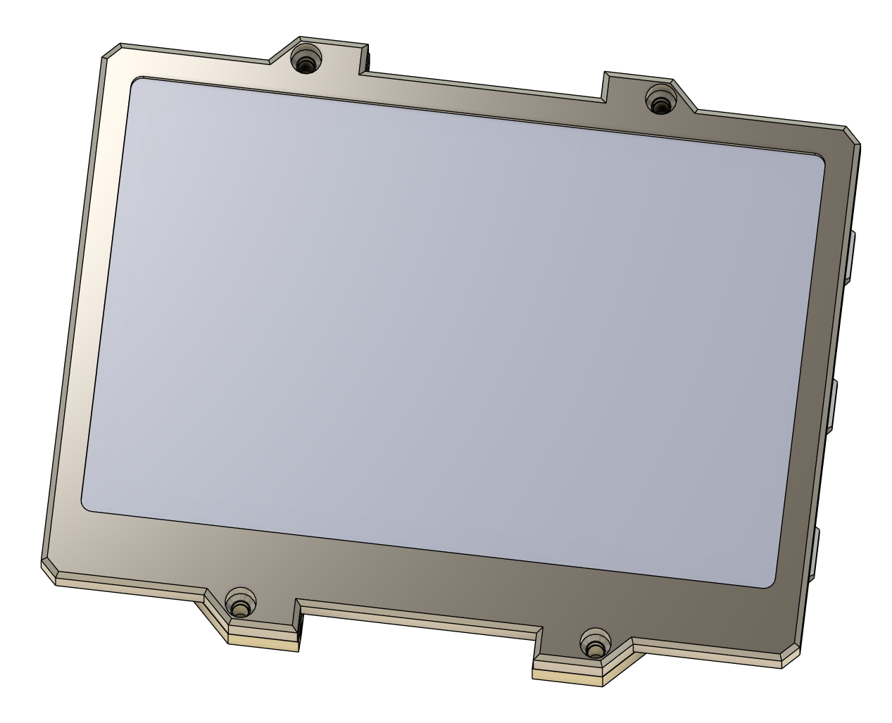

<!-- For new line: \ -->
<!-- Picture:   -->
<!-- New Line: "   "  -->

# Про проект DRM Watch v3
Наручний годинник на базі ESP32-S2 та SHARP Memory LCD.   
А все починалось з того, що мені сподобався дисплей...   
Тут можна знайти інфу і інструкції щоб зібрати собі такий годинник.   
Посилання що наведено в цьому тексті є актуальними станом на 2024-04. Якщо якісь товари будуть вже не актуальні, то шукайте за фотками))   
   

## Особливості годинника
- Стабільно працює і підходить для щоденного користування.
- Дисплей завжди показує час;
- Є дуже тускла але дуже приємна нічна підсвітка дисплея;
- Є ліхтарик, білий яскравий та червоний нічний;
- Акумулятора вистачає на понад 20днів;
- Зручні меню, звідки можна отримати доступ до всіх функцій;
- Наявність Wi-Fi, можна зберегти до 8 мереж в пам'яті;
- Можливість синхронізації часу по Wi-Fi;
- Багато мелодій. Їх можна або просто слухати або встановити на будильник.
- Мявчання кошенят;
- Кілька циферблатів, які можна налаштувати;
- Секундомір;
- Будильник;
- Календар;
- Зарядка по USB;
- Можна оновлювати прошивку по USB, не розбираючи годинник.
- Є індикатор заряду;
- Компоненти для збірки легко дістати;
- Корпус підходить для стандартних 20мм ремінців;
- Якщо під час експериментів з прошивками годинник завис, в корпусі передбачено отвір щоб голкою його перезавантажити.
- Водонепроникність до 0 метрів:) (можна трохи покращити якщо при збірці обробити плату лаком а корпус збирати з клеєм.)
- Годинник можна використовувати як поле для експериментів з ESP32-S2: акумулятор, 3 кнопки, пищалка, дисплей, 3 світлодіоди;
- Екран "Про годинник" містить інформацію про розробника та версію прошивки.

## Де брати комплектуючі

### Дисплей

 

Дисплей потрібен, щоб відображати інформацію користувачу:)   
Модель дисплея: **Sharp LS027B7DH01A**     
Він звісно недешений, але мені дуже подобається як він виглядає. Його можна купити готовим, я купував тут:    
https://www.aliexpress.us/item/1005005611440829.html   

### Конектор дисплея

 

Для підключення цього дисплея. Я купував модулем, але можна пошукати і роз'єм окремо.   
Модель: **FPC 10pin 0.5mm pitch** Я купував тут:     
https://www.aliexpress.us/item/1005002288363000.html    
https://www.aliexpress.us/item/10000348360254.html    

### Буззер

 

Буззер потрібен щоб пищати, грати мелодії.   
Модель: **Buzzer SMD 7525-3.6V-passive**. Я купував тут:     
https://www.aliexpress.us/item/1005003620083880.html    
https://eu.mouser.com/ProductDetail/CUI-Devices/CMT-7525S-SMT-TR?qs=qCxwlXJ4fnw4ZHFvNib47A%3D%3D

### ESP32

 

Я розпаював на комплектуючі плати **Lolin S2 Mini**, ось ссилка де я купував:   
https://www.aliexpress.us/item/1005004438665554.html   
   
Якщо немає бажання розпаювати Lolin S2 Mini, можна купити комплектуху окремо:   

 
 

Чіп: **ESP32-S2, QFN56**   
https://www.tme.eu/en/details/esp32s2/iot-wifi-bluetooth-modules/espressif/esp32-s2/    
https://eu.mouser.com/ProductDetail/Espressif-Systems/ESP32-S2?qs=GBLSl2Akirtmlui%2FgtDaSQ%3D%3D    
Кварц: **SMD 3225 4pin 40MHz**:   
https://www.aliexpress.us/item/1005004689346275.html   

### Модуль зарядки акумулятора

  

Щоб була можливість заряджати акумулятор. Причому якщо акума не буде - годинник не працюватиме навіть на зарядці.    
Тому якщо потрібно обійти модуль зарядки, можна замкнути перемичку біля мікросхеми заряду на платі (вона вона розташована біля самого краю плати) - вона подасть напряму напругу з USB порта замість напруги батареї. Основне не залишити перемичку зі вставленим акумом, щоб не отримати фаєр-шоу)))    
Розпаявши такий модуль можна дістати чіп **TP4056** , який відоповідає за зарядку акума. Датащит:   
https://dlnmh9ip6v2uc.cloudfront.net/datasheets/Prototyping/TP4056.pdf   
Якщо нема бажання розпаювати модуль, можна знайти окремо:   

 
 

Чіп: **TP4056**   
https://www.alibaba.com/product-detail/TC4056A-SOP-8-is-compatible-with_1600806443781.html   
Роз'єм: **TYPE-C-31-M-12**   
https://jlcpcb.com/partdetail/Korean_HropartsElec-TYPE_C_31_M12/C165948   

### Електролюмінесцентна панель

  

Цей елемент можна ставити або не ставити за бажанням, залежно від того чи потрібна вам нічна підсвітна екрана.    
Електролюмінесцентна панель (EL панель) є складовою частиною системи підсвітки. Це панель, що світиться під впливом високої напруги і частоти. Також їх називають світлоконденсаторами (LEC). Це просто цікаві факти щоб краще розуміти що воно таке.   
Фішка цього типу підсвітки в тому, що панель є дуже тонка, світить дуже рівномірно приємним синім кольором, а також її можна нарізати на фрагменти потрібної форми. Але після порізки складною є задача підключення до панелі. Я для підключення використовував одиночні жили дроти а також токопровідний клей.   
Мінуси: будучи розташована за дисплеєм який тут використовується, її ледь-ледь видно, але вночі цього достатньо. Також трохи пищить при роботі. А ще для її роботи потрібна досить складна схема драйвера.   
Раджу купувати синій колір, тому що EL панель натівно такого кольору, а в інші кольори її тупо фарбують, а фарба поглинає частину світла. Якщо прийшла пофарбована панель, її можна очистити від фарби лезом.   
Ось де я купував:   
https://www.aliexpress.us/item/1005003971896012.html   

### Драйвер електролюмінесцентної панелі

  

Цей елемент можна ставити або не ставити за бажанням, залежно від того чи потрібна вам нічна підсвітна екрана.    
Це та мікросхема, яка і формує змінну високу напругу для електролюмінесцентної панелі.    
Схему її підключення я не розумію, просто зібрав по схемі і воно запрацювало))    
Модель: **Microchip HV857MG MSOP8**    
Датащит:    
https://ww1.microchip.com/downloads/aemDocuments/documents/APID/ProductDocuments/DataSheets/HV857-High-Voltage-Low-Noise-EL-Lamp-Driver-IC-Data-Sheet-DS20005683.pdf    
Я купував тут:   
https://www.aliexpress.us/item/1005005512523052.html   

### Обвязка драйвера електролюмінесцентної панелі

 
 
 
 

Цей елемент можна ставити або не ставити за бажанням, залежно від того чи потрібна вам нічна підсвітка екрана.    
Насправді я в цій мелочовці взагалі не шарю, причому навіть деякі елементи замовив не ті що треба було... Але у мене воно запрацювало. Тому я кладу тут ссилки на те що я конкретно замовляв.    

Модель: **Capacitor SMD 1206 10NF X7R 200V**    
https://www.aliexpress.us/item/1005004628006766.html    

Модель: **1206 320PCS 16Value**    
https://www.aliexpress.us/item/1005006124283234.html    

Модель: **Diode ES1D**    
https://www.aliexpress.us/item/1005005254835443.html    

Модель: **SMD Inductor 1210 3225 22UH**    
https://www.aliexpress.us/item/32981310345.html    

### Клей для електролюмінесцентної панелі

  

Цей елемент можна ставити або не ставити за бажанням, залежно від того чи потрібна вам нічна підсвітка екрана.    
Модель: **MECHANIC MCN-DJ002 Conductive Adhesive Glue Silver**    
https://www.aliexpress.us/item/1005002369819447.html    

### SMD Резистори

  

Я робив плату під резистори **SMD 0603** (переважно), їх я брав з такого набору:    
https://www.aliexpress.us/item/1005002364437129.html    

### RTC модуль

   
  

Використовується мікросхема **Analog Devices DS3231**, я її купував в складі такого модуля:    
https://www.aliexpress.us/item/32822420722.html    
Але можна також знайти мікросхеми окремо. Ось ще трохи інфи по ним:    
https://octopart.com/ds3231-maxim+integrated-14739425
https://www.analog.com/en/products/ds3231.html    
https://www.analog.com/media/en/technical-documentation/data-sheets/DS3231.pdf    

### Світлодіод ліхтарика

  
  

Ці світлодіоди я діставав виключно з підсвітки старих телефонів, бо їх дисплеїв у мене багато.    
Але я знайшов їх типорозмір щоб можна було замовити окремо: **020 SMD Side View LED White 6000K**.    
Знайшов що тут можна замовити:   
https://www.aliexpress.us/item/32419907074.html    

### Кнопки

  

Я так і не знайшов як їх можна назвати, тому шукаємо по фото і цьому тексту: **2*4*3.5mm Micro SMD Tact Switch Side Button**
https://www.aliexpress.us/item/32880903601.html     

## Корпус

  

  

  

## Процес збірки та налагодження

 

Мені дуже допомогла в пайці така прикольна паяльна станція:
https://www.aliexpress.us/item/1005005609080807.html

 

На етапі налагодження може допомогти такий Breakout Board який підійде для ESP32-S2 (нагадую, там корпус QFN56)
https://www.aliexpress.us/item/1005002805132028.html

## Інструменти, які я використовував при проектуванні:
- Проектування плати та схеми: **KiCad 7**;
- Програмування: **Arduino IDE 2.2.1**;
- Розширення плати: **esp32 by Espressif v2.0.11, ESP32-S2** (В списку плат оберіть "Lolin S2 Mini");
- Конвертування іконок: **Програма LCD Assistant**. (Виберіть Horizontal)

## How to add own melodies:
To make melodies I used tool by ShivamJoker which I modified to generate my melody format.
Use tool in Software\MIDI-to-Arduino-main. 
Add melody array to MelodyPlayer.ini file and add melody to melodies array.

## Known libraries conflicts:
Temperature measurement is hanging system if after Wi-Fi usage it were not initialized.

##Steel Marking Process:
https://youtube.com/shorts/PZIMB8fdEP8?si=xofTaj4oOFBRnQQU

## References

- Big repository of phone melodies where I found some melodies
http://onj3.andrelouis.com/phonetones/unzipped/

##Історія проекту
- 2023 рік, я десь наткнувся на відео про sharp memory lcd зрозумів, що дуже хочу собі такий дисплей. Замовив на алі.
- 

