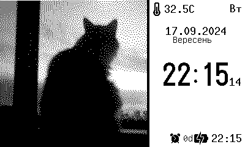
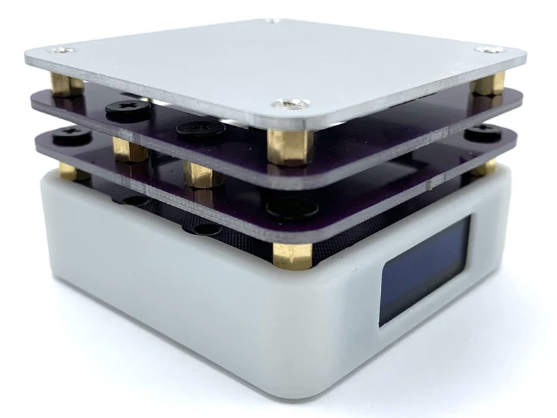

<!-- For new line: \ -->
<!-- Picture:   -->
<!-- New Line: "   "  -->

# Про проект DRM Watch 3

**DRM Watch 3** - це мій саморобний наручний годинник, в основі якого лежить дисплей Sharp Memory LCD, ESP32-S2 і бажання носити це на руці:)   
Це **НЕ "Smart годинник"**! Цей пристрій по своїй функціональності близький до звичайного електронного годинника, з кількома додатковими можливостями, і їх можна додавати, перепрограмовувати годинник під себе.   
Наразі в прошивці є всі можливості, що притаманні типовому годиннику і що дозволяє повноцінно використовувати його на щоденній основі.   
В цьому репозиторії можна знайти інфу і інструкції **щоб зібрати собі такий годинник**.   
   
Це у мене таке хобі:) Я в кінці 2023 поліз вивчати проектування плат, після появи 3д принтера в 2022 поліз вивчати 3д моделювання, а за освітою програміст.  От власне це все і зібралось воєдино в цьому проекті) Робив це все з нуля. А яка б класна з цього була дипломна робота)))   
   
Посилання що наведено в цьому тексті є актуальними станом на **2024-04**. Якщо якісь товари будуть вже не актуальні, то шукайте за фотками))   
   

## Фото
<!--p align="center">

</p-->

<!--p align="center">

</p-->

## Відео про годинник
Тут є трохи:
https://www.tiktok.com/@drfailov

## Особливості годинника
- Зроблено в Україні;
- Стабільно працює і підходить для щоденного користування;
- Дисплей завжди показує час;
- В годиннику є вбудована "флешка" на 1.2МБ, в яку можна закинути файли
- Годинник може відкрити монохромний BMP, Wav файли, текстовий TXT документи
- Є дуже тускла але дуже приємна нічна підсвітка дисплея;
- Є ліхтарик, білий яскравий та червоний нічний;
- Акумулятора вистачає на понад 14днів, є індикатор заряду;
- Зручні меню, звідки можна отримати доступ до всіх функцій;
- Наявність Wi-Fi, можна зберегти до 8 мереж в пам'яті;
- Можливість синхронізації часу по Wi-Fi;
- Багато мелодій. Їх можна або просто слухати або встановити на будильник.
- Імітація звуку мявчання кошенят;
- Кілька циферблатів, які можна налаштувати;
- На циферблати можна додати календар, стрілочний годинник, дату, та цікавий фон
- Секундомір, працює в фоні;
- Будильники, до 6шт з назвами;
- Вічний календар (або я ще не догортав до кінця);
- Повнекранні клітинні автомати та анімації (Життя, Мураха, Вогонь, Шум, Лава, Мураха, Точки)
- Зарядка по USB, в тому числі від TypeC-TypeC;
- Можна оновлювати прошивку по USB, не розбираючи годинник.
- Компоненти для збірки легко дістати;
- Корпус підходить для стандартних 22мм ремінців;
- Зручно і просто прошивати. Можна написати свою прошивку.
- Якщо під час експериментів з прошивками годинник завис, в корпусі передбачено отвір щоб голкою його перезавантажити.
- Водонепроникність до 0 метрів:) (можна трохи покращити якщо при збірці обробити плату лаком а корпус збирати з клеєм.)
- Годинник можна використовувати як поле для експериментів з ESP32-S2: акумулятор, 3 кнопки, пищалка, дисплей, 3 світлодіоди;
- UART лог: інструмент для розробників, виводить на екран всі байти що надходять по UART.
- Екран "Про годинник" містить інформацію про розробника та версію прошивки.

## Застереження під час користування:

- Годинник **не можна мочити**. Захист від води тут майже відсутній і це призведе до поломки годинника. Від дрібного дощу або поту йому нічого не буде, а от залити при митті рук - може бути проблемою.
- Годинник **слабко захищений від ударів**. Дисплей не захищений, тонкі рамки, тонкий корпус, годинник спроектований без великого запасу механічної міцності, так він  ще й досить габаритний. Тому вдарити його легко, і це скоріше за все призведе до розбитого дисплея. Протягом моїх місяців експлуатації проблем з пошкодженням годинника не було, але я користувався досить обережно.
- Годинник варто **оберігати від впливу статики**. Є невеликий шанс вбити годинник якщо швидко змімати з себе светр) Тому або знімайте светр повільно, або зніміть перед цим годинник, або використовуйте светр який не електризується. Особливо ризикований момент - постановка на зарядку, тут може проскочити прямо через контроллер. Раджу перед тим як вставити кабель зарядки, доторкнутись до металевої частини корпусу зарядного пристрою - так ви розрядитесь через корпус, а не через годинник і все буде ок.

## Короткий відео огляд годинника:
[
 
](https://www.youtube.com/watch?v=3oIwZVaCEvY) 

https://www.youtube.com/watch?v=3oIwZVaCEvY 

## Короткий відео огляд мелодій:
[
 
](https://www.youtube.com/watch?v=Ylm3CU0DTDE) 

https://www.youtube.com/watch?v=Ylm3CU0DTDE 

# Опис меню, функцій та екранів

## Основний екран, циферблат

 
       
       
       
       
       
       
       
<!--img src="Photos/photo_2_2024-06-02_22-49-14.jpg" height=200"/> 
 
 
 
 
 
 

Тут відображаєтья час. Це основний екран годинника, на нього переходят більшість екранів по таймеру бездіяльності. На цьому екрані годинник заходить в сон і спить, просинаючись раз в хвилину щоб намалювати час.      
Вміст циферблату можна налаштувати під себе, тому тут так багато різних його фоток         
**Кнопка вгору** (коротке натиснення) - Відкрити секундомір.       
**Кнопка вгору** (довге натиснення) - Відкрити таймер.       
**Середня кнопка** (коротке натиснення) - Увімкнути ліхтарик.       
**Середня кнопка** (довге натиснення) - вимкнути годинник.       
**Кнопка вниз** - відкрити меню програм.       

## Програми

 
 
<!--img src="Photos/photo_3_2024-06-02_22-49-14.jpg" height=300"/--> 

Звідси можна запустити функції які не є налаштуваннями. Будильники, секундоміри, ігри, розваги, тощо.      
З цього екрану годинник автоматично перейде на основний екран через кілька хвилин бездіяльності.     
**Кнопками вгору та вниз** - обрати пункт меню.      
**Центральна кнопка** - активує обраний пункт меню.       

## Програми -> Будильник

 
 
 
 

Будильник запускає відтворення заданої мелодії в заданий час дня.      
З цього екрану годинник автоматично перейде на основний екран через кілька хвилин бездіяльності.     
Можна налаштувати кілька будильників. До кожного можна задати час, назву та мелодію. Будильник спрацює якщо годинник заряджений і якщо годинник звісно знає поточний час. Спрацює також якщо в момент спрацювання ви знаходитесь в меню а не на циферблаті, а також спрацює якщо годинник вимкнено (але він при цьому заряджений).      
**Кнопками вгору та вниз** - обрати пункт меню.       
**Центральна кнопка** активує обраний пункт меню.       
Коли пункт меню активований, **кнопки вниз та вгору міняють значення пункту**.      
Під час будильника гратиме обрана мелодія і відображатиметься назва будильника та час на який будильник було встановлено. Під час спрацювання будильника його можна закрити (вимкнути на поточний раз), або вікласти на 10 або 5 хвилин (за умови якщо в цей момент не запущено таймер). Після спрацювання будильника він спрацює знову наступного дня. 

## Програми -> Календар

 
 
<!--img src="Photos/photo_14_2024-06-02_22-49-14.jpg" height=300"/--> 

Показує календар на місяць.      
З цього екрану годинник автоматично перейде на основний екран через кілька хвилин бездіяльності.     
**Кнопками вгору та вниз** - змінити поточний місяць.      
**Центральна кнопка** - вийти.      

## Налаштування

 
 

## Налаштування -> Дисплей

 
 

### Інверсія

 
 
 

### Мова

 
 
 

### Калібрування акумулятора 

 
 

Кожен годинник - унікальний, тому кожен показує заряд по своєму.       
Щоб компенсувати цю неточність, я додав алгоритм який це виправляє, але для цього йому потрібно знати свою криву розряду. Щоб провести калібрування:       
- повністю зарядити годинник 
- зняти з зарядки і пройти в налаштування -> дисплей ->калібрування акумулятора
- натиснути там початок калібровки.
- лишити годинник увімкненим на кілька годин поки він не вимкнеться.
Коли годинник вимкнеться, його можна поставити на зарядку і після цього він буде готовий до роботи з новою калібровкою     

## Програми -> Файли

 
 
 

Важливо!!! Не зберігайте на годиннику цінну інформацію яка не має копії! У мене кілька разів "ламалась" файлова система і файли втрачались. 
Закономірностей цього явища поки не виявив, але я б не довіряв годиннику нічого цінного!

Формати файлів які може відкрити годинник:
- BMP монохромний. Такі файли можна сформувати з допомогою Microsoft Paint.
- DWM мелодії. Такі файли можна сформувати з допомогою програми в папці `Software\MIDI-to-Arduino-main`.
- WAV PCM 8bit аудіо. Такі файли можна сформувати з допомогою Audacity.
- TXT текстові файли в UTF8 кодуванні. Такі файли можна сформувати з допомогою Notepad++.

 
 
 

## Програми -> Менеджер пам'яті

 
 
 
 

**Підключити до USB** - імітує підключену флешку.
**Показати карту розділів** - Відображає як поділена пам'ять ESP32.

## Програми -> Мелодії

 
 

Меню зі списком мелодій. Можна переглянути назви та увімкнути мелодію. Їх там багато.      
Я постійно додаю нові мелодії, зокрема з мемів. Додати свої мелодії також можливо, дивіться розділ як зібрати прошивку а потім як додати мелодію.      
З цього екрану годинник автоматично перейде на основний екран через кілька хвилин бездіяльності.     
**Кнопками вгору та вниз** - обрати мелодію.      
**Центральна кнопка** - відкрити і відтворити мелодію.    

## Програми -> Мелодії -> Плеєр

 
 

Коли грає мелодія. Цей екран може бути запущений при спрацюванні будильника або якщо відкрити мелодію зі списку.     
Якщо запущений при спрацюванні будильника:     
**Кнопками вгору та вниз** - відкласти будильник. Мелодія зупиниться і буде запущено таймер на 10 або 5 хвилин. Якщо якийсь таймер вже запущений - відкласти будильник не вийде.      
**Центральна кнопка** - Зупинити відтворення мелодії та повернутись до попереднього меню.         

Якщо запущений при відкриванні мелодії зі списку:     
**Кнопка вниз** - увімкнути або вимкнути повтор мелодії. Якщо запущено повтор, в статусному рядку відображатиметься відповідна піктограма, а мелодія гратиме доки годинник не розрядиться.       
**Центральна кнопка** - Зупинити відтворення мелодії та повернутись до попереднього меню.        

## Програми -> Таймер

 
 

Таймер веде відлік заданого часу від моменту запуску. Коли час спливає, запускається звуковий сигнал.       
З цього екрану годинник автоматично перейде на основний екран через кілька хвилин бездіяльності.       
**Кнопками вгору та вниз** - задається час на який встановлюється таймер.      
**Центральна кнопка** - або закриває програму, або запускає таймер.       
Коли лунає звуковий сигнал, його можна закрити, або вікласти на 10 або 5 хвилин.

## Програми -> Секундомір

 
 

Веде відлік часу від моменту запуску.         
На цьому екрані годинник спить, і не виходить на циферблат.        
Секундомір може працювати в фоні. 
Поточне значення секундоміра (години, хвилини) відображатиметься в статусному рядку у всіх вікнах програми.         
Внизу відображається історія, які значення коли були скинуті.         
**Кнопка вгору** - Запустити або призупинити секундомір.       
**Кнопка вниз** - Скидає показник секундоміра.       
**Центральна кнопка** - вихід на циферблат.       

## Програми -> Ліхтарик

 
 

Запускає ліхтарик. Програма при цьому ніяка не відкривається, просто вмикається світло.        
У ліхтарика два режими роботи - червоним світлодіодом і білим.         
Червоний буде корисним вночі - так він не сліпить і після його використання буде все ще добре видно вночі. 
Денний ліхтарик більш яскравий.        
Ліхтарик автоматично вимкнеться через кілька хвилин бездіяльності.    
**Один раз натиснути на кнопку** - якщо ліхтарик вимкнено - увімкнути нічний ліхтарик.        
**Другий раз натиснути** - увімкнути денний режим.        
**Якщо ліхтарик вже світить** - більше 5 секунд, то натиснення на кнопку його вимкне.        
Тобто якщо вночі запустити нічний ліхтарик, покористуватись ним, то натиснення на іконку ліхтарика не запустить денний ліхтар а вимкне ліхтар.        
Щоб запустити денний ліхтар - кнопку треба натиснути двічі протягом 2 секунд.        

## Програми -> Інженерне меню

 
 
 

На цьому екрані зібрано максимум технічної інформації яка допоможе зрозуміти стан системи.        
На цьому екрані годинник спить, і не виходить на циферблат.        
**Центральна кнопка** - вийти до меню програм.        
**Кнопка вгору** - активувати чи вимкнути режим безсоння      
В режимі безсоння годинник не буде йти в сон по таймеру. 
В цьому режимі годинник дуже швидко розрядиться, за кілька годин. 
В режимі безсоння в статусбарі буде відображатись інонка з кавою, а в інженерному меню буде написано "Don't sleep: 1".      

## Програми -> Лог UART

 
 

Годинник при підключенні до компа імітує на компі **COM порт**. 
Всі дані що надходять на COM порт - виводяться в лог на екрані.    
Це може бути корисно якщо потрібно зрозуміти яку команду надсилає 
невідома вам програма до підключеного пристрою в процесі, наприклад, діагостики або реверс інжинірінгу.    
Відображення відбувається в форматі лога, можна виводити як в текстовому форматі (ASCII) так і в форматі шістнадцяткових байтів (HEX).   
На цьому екрані годинник не спить і не виходить на циферблат автоматично! Він буде увімкнений доти, доки його не вимкнути вручну або він не розрядиться повністю.   
**Кнопка вгору** - ставить зображення на паузу - якщо потрібно детальніше вивчити отримані дані. Нові дані не будуть виводитись на екран.   
**Центральна кнопка** - вийти до меню програм.   
**Кнопка вниз** - перемкнути режим відображення (ASCII чи HEX).   

## Програми -> Meow

 
 

Симуляція мявчання кошенят. Генерується програмно випадковим чином. Можна обрати тон мявчання та вийти.

## Програми -> Життя

 
 

Режим повноекранного кліткового автомату "Життя" (Convey's Game Of Life).     
**Будь-яка з кнопок** - повернутись до меню програм.     

## Програми -> Вогонь

 
 

Режим повноекранної анімації вогню. Красиво. В основі лежить шум Перліна.     
**Будь-яка з кнопок** - повернутись до меню програм.     
Дякую за допомогу з реалізацією Кирилу Лейферу, ось його репозиторій: https://github.com/BOOtak/dct3ngine/blob/master/src/games/perlin_test

## Програми -> Лава

 
 

Режим повноекранної анімації лави. Красиво. В основі лежить шум Перліна.     
**Будь-яка з кнопок** - повернутись до меню програм.     
Дякую за допомогу з реалізацією Кирилу Лейферу, ось його репозиторій: https://github.com/BOOtak/dct3ngine/blob/master/src/games/perlin_test

## Програми -> Мураха

 
 

Режим повноекранного кліткового автомату "Мураха Ленгтона".     
**Кнопки вниз або вгору** - змінити швидкість симуляції.     
**Середня кнопка** - повернутись до меню заставок.     

## Налаштування -> Вміст циферблату
Одночасно відображатиметься тільки один фон, тому щоб був відображався потрібний фон, потрібно залишити активний тільки один з доступних.     
Кнопками вгору та вниз - обрати пункт меню. Центральна кнопка міняє обраний пункт меню. 

# Де брати комплектуючі

 

Готових годинників в продажу не існує, тому якщо є бажання отримати такий годинник, можна зібрати самому.

### Дисплей

 

Дисплей потрібен, щоб відображати інформацію користувачу:)   
Модель дисплея: **Sharp LS027B7DH01A**     
Він звісно недешений, але мені дуже подобається як він виглядає. Його можна купити готовим, я купував тут:    
https://www.aliexpress.us/item/1005005611440829.html   

### Конектор дисплея

 

Для підключення цього дисплея. Я купував модулем, але можна пошукати і роз'єм окремо.   
Модель: **FPC 10pin 0.5mm pitch** Я купував тут:     
https://www.aliexpress.us/item/1005002288363000.html    
https://www.aliexpress.us/item/10000348360254.html    

### Акумулятор

 

Якщо потрібно щоб пристрій працював автономно, то потрібен акумулятор.   
Корпус та плата спроектовано під літій-іонний акумулятор такої форми: 35*25*5mm. Звісно, підійде будь-який і меншого розміру, але матиме меншу ємність.   
Модель яка найкраще підходить: **lipo 502535**. Я купував тут:     
https://prom.ua/ua/p1286391849-akkumulyator-kontrollerom-universalnyj.html    

### Буззер

 

Буззер потрібен щоб пищати, грати мелодії.   
Модель: **Buzzer SMD 7525-3.6V-passive**. Я купував тут:     
https://www.aliexpress.us/item/1005003620083880.html    
https://eu.mouser.com/ProductDetail/CUI-Devices/CMT-7525S-SMT-TR?qs=qCxwlXJ4fnw4ZHFvNib47A%3D%3D

### Мосфет

 

Мосфет використовується для того щоб керувати буззером, щоб на нього надходив не слабкий сигнал з мікроконтроллера, 
а потужний з батареї.     
Модель: **2N7002LT1G**. Можна купити тут:     
https://www.aliexpress.us/item/1005003079655220.html     

### ESP32

 

Я розпаював на комплектуючі плати **Lolin S2 Mini**, ось ссилка де я купував:   
https://www.aliexpress.us/item/1005004438665554.html   
   
Якщо немає бажання розпаювати Lolin S2 Mini, можна купити комплектуху окремо:   

 
 

Датащіт:
https://www.espressif.com/sites/default/files/documentation/esp32-s2_datasheet_en.pdf 
Чіп: **ESP32-S2FN4R2, QFN56**   
https://www.tme.eu/ua/details/esp32s2fn4r2/moduli-iot-wifi-bluetooth/espressif/esp32-s2fn4r2    
Кварц: **SMD 3225 4pin 40MHz**:   
https://www.aliexpress.us/item/1005004689346275.html   

### Модуль зарядки акумулятора

  

Щоб була можливість заряджати акумулятор. Причому якщо акума не буде - годинник не працюватиме навіть на зарядці.    
Тому якщо потрібно обійти модуль зарядки, можна замкнути перемичку біля мікросхеми заряду на платі (вона вона розташована біля самого краю плати) - вона подасть напряму напругу з USB порта замість напруги батареї. Основне не залишити перемичку зі вставленим акумом, щоб не отримати **фаєр-шоу**)))    
Розпаявши такий модуль можна дістати чіп **TP4056** , який відоповідає за зарядку акума. Датащит:   
https://dlnmh9ip6v2uc.cloudfront.net/datasheets/Prototyping/TP4056.pdf   
Якщо нема бажання розпаювати модуль, можна знайти окремо:   

 
 
 

Чіп: **TP4056**   
https://www.alibaba.com/product-detail/TC4056A-SOP-8-is-compatible-with_1600806443781.html   
Роз'єм: **TYPE-C-31-M-12**   
https://jlcpcb.com/partdetail/Korean_HropartsElec-TYPE_C_31_M12/C165948   
Світлодіод: **0805 SMD LED**   
https://www.aliexpress.us/item/4000936781234.html   

### SMD Резистори

  

Я робив плату під резистори **SMD 0603** (переважно), їх я брав з такого набору:    
https://www.aliexpress.us/item/1005002364437129.html    

### SMD Конденсатори

  

Я робив плату під конденсатори **SMD 0603** (переважно), їх я брав з такого набору:    
https://www.aliexpress.us/item/1005006124283234.html    

### RTC модуль

   
  

Використовується мікросхема **Analog Devices DS3231**, я її купував в складі такого модуля:    
https://www.aliexpress.us/item/32822420722.html    
Але можна також знайти мікросхеми окремо. Ось ще трохи інфи по ним:    
https://octopart.com/ds3231-maxim+integrated-14739425
https://www.analog.com/en/products/ds3231.html    
https://www.analog.com/media/en/technical-documentation/data-sheets/DS3231.pdf    

### Світлодіод ліхтарика

  
  

Ці світлодіоди я діставав виключно з підсвітки старих телефонів, бо їх дисплеїв у мене багато.    
Але я знайшов їх типорозмір щоб можна було замовити окремо: **020 SMD Side View LED White 6000K**.    
Знайшов що тут можна замовити:   
https://www.aliexpress.us/item/32419907074.html    

### Кнопки

  

Я так і не знайшов як їх можна назвати, тому шукаємо по фото і цьому тексту: **2\*4\*3.5mm Micro SMD Tact Switch Side Button**   
https://www.aliexpress.us/item/32880903601.html     

### Місця для гвинтів

  

Такі можна знайти на материнці DJI Mavic 3. Під гвинт М1.4   
Орієнтовна назва: SMTSO Surface Mount Copper Nut M1.4X3X1.5-2X0.8   
Щось схоже:   
Обирати: M1.4X3X1.5-2X0.8  
https://www.aliexpress.com/item/1005005579653583.html

### Гвинти для задньої кришки

  

Я їх брав з материнки мавіка 3.   
Тип: PH000, M1.4, 3mm      
Приклад де замовити:   
Обрати Size: M1.4 X 50pcs   Length: 3mm   
https://www.aliexpress.com/item/1005002364568213.html   

### Гвинти для передньої кришки

  

Я їх брав з Nokia 1280, вона скручена на такі.   
Тип: T5, 1.5mm по пластику    

Схожі можна замовити тут:   
В складі набору є гвинти 1.4мм, вони мають підійти.   
https://www.aliexpress.com/item/1005002324715062.html   

### Електролюмінесцентна панель

  

Цей елемент можна ставити або не ставити за бажанням, залежно від того чи потрібна вам нічна підсвітна екрана.    
Електролюмінесцентна панель (EL панель) є складовою частиною системи підсвітки. Це панель, що світиться під впливом високої напруги і частоти. Також їх називають світлоконденсаторами (LEC). Це просто цікаві факти щоб краще розуміти що воно таке.   
Фішка цього типу підсвітки в тому, що панель є дуже тонка, світить дуже рівномірно приємним синім кольором, а також її можна нарізати на фрагменти потрібної форми. Але після порізки складною є задача підключення до панелі. Я для підключення використовував одиночні жили дроти а також токопровідний клей.   
Мінуси: будучи розташована за дисплеєм який тут використовується, її ледь-ледь видно, але вночі цього достатньо. Також трохи пищить при роботі. А ще для її роботи потрібна досить складна схема драйвера.   
Раджу купувати синій колір, тому що EL панель натівно такого кольору, а в інші кольори її тупо фарбують, а фарба поглинає частину світла. Якщо прийшла пофарбована панель, її можна очистити від фарби лезом.   
Ось де я купував:   
https://www.aliexpress.us/item/1005003971896012.html   

### Драйвер електролюмінесцентної панелі

  

Цей елемент можна ставити або не ставити за бажанням, залежно від того чи потрібна вам нічна підсвітна екрана.    
Це та мікросхема, яка і формує змінну високу напругу для електролюмінесцентної панелі.    
Схему її підключення я не розумію, просто зібрав по схемі і воно запрацювало))    
Модель: **Microchip HV857MG MSOP8**    
Датащит:    
https://ww1.microchip.com/downloads/aemDocuments/documents/APID/ProductDocuments/DataSheets/HV857-High-Voltage-Low-Noise-EL-Lamp-Driver-IC-Data-Sheet-DS20005683.pdf    
Я купував тут:   
https://www.aliexpress.us/item/1005005512523052.html   

### Обвязка драйвера електролюмінесцентної панелі

 
 
 
 

Цей елемент можна ставити або не ставити за бажанням, залежно від того чи потрібна вам нічна підсвітка екрана.    
Насправді я в цій мелочовці взагалі не шарю, причому навіть деякі елементи замовив не ті що треба було... Але у мене воно запрацювало. Тому я кладу тут ссилки на те що я конкретно замовляв.    

Модель: **Capacitor SMD 1206 10NF X7R 200V**    
https://www.aliexpress.us/item/1005004628006766.html    

Модель: **1206 320PCS 16Value**    
https://www.aliexpress.us/item/1005006124283234.html    

Модель: **Diode ES1D**    
https://www.aliexpress.us/item/1005005254835443.html    

Модель: **SMD Inductor 1210 3225 22UH**    
https://www.aliexpress.us/item/32981310345.html    

### Клей для електролюмінесцентної панелі

  

Цей елемент можна ставити або не ставити за бажанням, залежно від того чи потрібна вам нічна підсвітка екрана.    
Цей клей я використовую для того щоб під'єднати дроти до електролюмінесцентної панелі. Детальніше про процес можна почитати в розділі "процес збірки".    
Модель: **MECHANIC MCN-DJ002 Conductive Adhesive Glue Silver**    
https://www.aliexpress.us/item/1005002369819447.html    

### Ремінець

  

 

Можна купити на алі, вибір великий. Потрібні стандартні ремінці **шириною 22мм**.    
До прикладу, можна замовити тут:    
https://www.aliexpress.us/item/1005005890436737.html    

До ремінців як правило йдуть в комплекті і піни для встановлення, але якщо його в комплекті нема, можна замовити окремо:    
https://www.aliexpress.us/item/1005006026719458.html    

### Заглушка роз'єма USB

  

Оскільки годинник використовується в умовах високої вологи та поту, нагальною є проблема 
окислення роз'єма USB, що з часом призводить до того що роз'єм працює нестабільно, а годинник 
стає все складніше заряджати або прошивати.    
Використання подібних заглушок вирішує дану проблему.   
Лишається тільки не загубити її:)   
 
Я їх купував тут:   
https://www.aliexpress.com/item/4000148621089.html

## Корпус

  

Корпус спроектовано для простоти збірки та простоти друку на FDM 3D принтері. При цьому можна також замовити друк металом або фрезерування.   
Малював корпус в Fusion 360, якщо потрібно щось змінювати, відкривайте файли `.f3d`. В папці купа версій, шукайте версію з новішою датою в назві.   
Корпус спроектовано під **ремінці 22мм**.   
Корпусні частини краще друкувати з чорного платику, а вкладку з кнопками - прозорим пластиком, щоб через нього світили ліхтарики.   
В папці багато файлі і моделей, обираючи найновіший дивіться на номер версії або дату в назві файлу.   
Для замовлення фрезерування та лазерного маркування вам знадобиться файл `.step` та `.dwg`.   
Для друку металом або звичайним 3д принтером знадобиться `.stl` файл. (по одному на кожну частину корпусу)

## Плата

  

  
  
  
  
  

Корпус спроектований під плату товщиною **0.8mm**. Колір плати можна обирати на свій смак, я обирав чорні.   
В папці можна знайти плати різних ревізій, коротко про ревізії:   
**Rev 1:** конденсатори розміщені надто далеко від контроллера, конденсаторів мало, 
немає елементів що формують EN для контроллера, нема RTC мікросхеми, антена на платі неефективна, 
розпіновка в деяких моментах відрізняється від нової ревізії, елементи розміщені не плотно, немає ніякої підсвітки.   
**Rev 2:** вісутні підтяжки RTC SCL та SDA. Елементи розміщені не плотно, підсвітна світлодіодна і неефективна.   
**Rev 3:** Помилок по схемі наче поки немає, я зібрав і воно одразу запрацювало. 
Підсвітка електролюмінесцентна з драйвером. Компоненти розміщені плотно. Можна поставити великий акум на 500мАг.   
**Rev 4:** Додано піни щоб підключити до RTC окремий акум щоб не збивався час при розрядці акумулятора, 
додано елементи які відповідають за роботу вібро. Поки програмно він ніяк не задіяний, але хай буде.     

Щоб замовити собі плату, можна скористатись файлами в папках GERBER. Знаходяться вони тут: `Board\Gerber OUTPUTs`   
Ці файли достатньо завантажити на сайт не виготовляють плати, я замовляв у **jlcpcb.com**. 
Там одразу має бути видно як виглядатиме плата.    
Якщо потрібно щось поміняти - ставимо KiKad, відкриваєм проект `Board\KiCad Project\_DRM_Watch_v3\DRM_Watch_V3.kicad_pro` і можна міняти.    
Експортувати Gerber на Drl можна в редакторі плат KiKad.   
Також в схемі в проекті я до кожного елемента пододавав інфу про те де його можна замовити (якщо знаю звісно)   

### Пайка елементів на плату

  

В проекті KiKad є більше інфи що і куди паяти, що з чим з'єднано. Якщо немає бажання відкривати проект, то я вивів потрібну інфу в файл `Doc\2024-09-29 Board Soldering Plan.pdf`

### Замовлення зібраної плати
Деякі виробники плат в Китаї пропонують замовлення плат вже готовими і зібраними (PCBA = PCB Assemply). Як правило процес замовлення не надто автоматизований, а робота таких виробників покладається на роботу менеджерів. Тому такі замовлення вони часто приймають у форматі особистої переписки в месенджерах.   
Для такого замовлення їм треба наступна інформація:
- Gerberи плати. Це формується з редактора плат KiKad в файли `.gbr` і містить інформацію про саму плату (всі її шари). Один файл `.gbr` це один шар плати. Можна взяти в папці `Board/2024-04-18 GERBER REV4` (або новішу).
- Список елемнетів які розміщено на платі, тобто файл BOM. Він формується зі схеми в KiKad в файл `.csv` і містить інформацію про номер елемента на платі, виробника, назву компонента, посилання де його можна замовити, та опис кожного елемента. Можна взяти в папці `Board/2024-04-18 GERBER REV4` (або новішу).
- Інформацію про розміщення елементів на поверхні плати. В моєму випадку це окремий шар на Gerber плати, а саме `DRM_Watch_V3-F_Fab.gbr`. Там я розписав розміщення елементів, причому я робив це для себе в довільному по суті форматі, але цей файл підійшов для замовлення.
- Інформація про тип плати, в моєму випадку це товщина **0.8mm** та колір чорний.

# Процес збірки та налагодження

## Підготовка електролюмінесцентної панелі

 
 
 
 

Оскільки щоб встановити електролюмінесцентну панель, її потрібно **порізати**, то з'являється проблема її підключення, 
адже контакти панелі відріжуться. Окрім того все підключення слід виконати **дуже компактно**, оскільки місця під дисплеєм мало.    
У тих панелей що я замовляв, на зворотній стороні можна було бачити, що два контакти які живлять панель **проходять по вьому її периметру**. В них і будем підключатись. Щоб все працювало треба один дріт підключити до зовнішнього електрода, а другий до центрального.    
Підключатись будемо одною **тонкою жилою багатожильного дроту**. Вона звісно дуже тендітна, але в зібраному годиннику це не проблема.    
Я робив так: 
- беремо гостре (свіже, незатуплене) лезо, і під мікроскопом **розрізаємо ламінацію панелі**. Діяти треба обережно, щоб не пошкодити 
нічого зайвого.    
- Далі в цей розріз обережно **запихуємо кінець жили дроту**, пінцетом або лезом. Бажано щоб всередину помістилось хоча б 4мм дроту.    
- Далі набираємо на зубочистку провідний клей, зовсім трішки, і **набиваємо провідний клей всередину** вслід за дротом. Далі чекаємо поки клей засохне.    
- Процес засихання клею можна прискорити прогрівши місце поклейки до температути приблизно **100 градусів на хвилин 20**. Я робив це на паяльному столику.    
- Після поклейки вигинаємо жили дроту так щоб вони виходили до контактів `EL1` та `EL2` на платі, і всю цю поклейку і **жили фіксуємо скотчем.**     
 

На цьому етапі ми маємо панель з двома надтонкими жилами які виходять з неї. Можна паятись до плати і має працювати.    
Якщо не працює - варіанти звісно два, або платою не генерується напруга або щось не так з панеллю.     
Плату перевірити легко - звичайним мульмиметром в режимі **вимірювання змінної напруги** поміряти між `EL1` та `EL2`. Має бути приблизно 90 вольт змінного струму.     Якщо напруга є - проблема в панелі.

## Інструменти та розхідники

 

Мені дуже допомогла в пайці така прикольна паяльна станція:   
https://www.aliexpress.us/item/1005005609080807.html   

 

На етапі налагодження може допомогти такий **QFN56 Breakout Board** який підійде для ESP32-S2 (нагадую, там корпус QFN56)   
https://www.aliexpress.us/item/1005002805132028.html   

 

**Uretan 71**   
Для покриття плат лаком я використовував таку штуку як **Uretan 71**. Наносив за допомогою маленького пензля в два шари.    

## Інструменти, які я використовував при проектуванні:
- Проектування плати та схеми: **KiCad 7.0.9**;
- Формування BOM: **bom_csv_grouped_by_value_with_fp.py** (розташований в папці `Board`);
- Написання прошивки: **VSCode** (проект в папці `Firmware`);
- Розширення плати: **PlatformIO + Espressif32** (В списку плат оберіть "Lolin S2 Mini");
- Конвертування іконок: **Програма LCD Assistant**. (Виберіть Horizontal).
- Написання флешера: **Visual Studio + C# + WindowsForms + .NET Framework 4.6**.

# Прошивка
Прошивка написана на C++ в **VSCode 1.89.1** з використанням розширення **PlatformIO**, компілювати треба під плату **Lolin S2 Mini**.    
Як не складно помітити, прошивка містить багато робочих екранів (я їх назвав режимами або Mode). Кожен з них - це окремий набір функцій Setup, Loop, Exit, OnButton..., тощо.    
Перехід між режимами (екранами) здійснюється викликом функції `SetupMode...()` для відповідного режиму (екрану) який треба запустити. Ця функція має замінити адреси виконавчих функцій на свої.    
Кожен режим в прошивці (поточний екран, mode) - це комплект функцій які займаються відмальовуванням екрану та обробкою кнопок. Кожен режим може робити по суті що завгодно.    
Основний спосіб навігації в прошивці це змінні типу `Runnable`:  `modeSetup, modeLoop, modeButtonUp, modeButtonCenter, modeButtonDown, modeButtonUpLong, modeButtonCenterLong, modeButtonDownLong`.     
Ці змінні знаходяться в файлі Global і доступні з усієї програми. В кожен момент часу містять посилання на функції які відповідають поточному режиму (екрану). Саме ці змінні викликає кореневий Loop.    
Коли потрібно перемкнути режим (поточний екран), функція `modeSetup` відновідного режиму має перезаписати ці посилання, 
і відновідно `loop` викликатиметься вже інший, малюватиметься інша інфа, користувач бачитиме інший екран та взаємодіятиме з ним.    
    
 
- **enableAutoReturn** - чи з цього режиму годинник виходитиме автоматично якщо його залишити. Ця логіка реалізована в коненевому Loop.	
- **enableAutoSleep** - Чи в цьому режимі годинник буде спати не виходячи з нього. Важливо пам'ятати що сон стирає всю оперативку. Ця логіка реалізована в коненевому Loop.

**modeSetup** - поточного режиму функція входу. Вона має:
- Виконати modeExit якщо вона не нульова (щоб завершити попередній режим)
- Відтворити анімацію виходу з попереднього меню: clearScreenAnimation()
- Задати змінні для даного режиму: modeSetup, modeLoop, modeExit. Якщо щось з цього нема, ТРЕБА задати 0.
- Задати дії кнопок доя даного режиму: modeButtonUp, modeButtonCenter, modeButtonDown, modeButtonUpLong, modeButtonCenterLong, modeButtonDownLong.  Якщо щось з цього нема, ТРЕБА задати 0.
- Викликати registerAction();
- Задати правила цього режиму: enableAutoReturn, enableAutoSleep, autoReturnTime, autoSleepTime.
   
**modeLoop** - поточного режима Loop функція. 
- Намалювати екран
- Обробити дані
- кнопки обробляти тут не треба оскільки вони обробляються окремо і будуть викликані відповідні функції.
   
**ModeExit** - функція призначена для завершення "роботи" що робилась в поточному режимі.
- Можна почистити пам'ять
- Позакривати файли якщо відкриті
- вимкнути вайфай, діоди, чи що ще використовувалось
- при виконанні завжди в ній треба додавати modeExit = 0; щоб не було повторного запуску 

## Структура роботи батареї
В процесі виявлення рівня заряду застосовується
- Усереднене значення кількох замірів
- Виявлення аномалій в значеннях та відсікання аномальних
- Таблиця калібровки для розрахунку відсотка
- Гістерезис для ігнорування дрібних змін відсотка
- Дабл-чек якщо є підозра на 

Послідовність руху даних:
- `analogRead()`    
Беремо сире зашумлене значення з ADC.    
**Діапазон:** [0...8096], **Шумів** - ДУЖЕ багато.

- `analogSmoothRead()`     
Згладжуємо середнім - протитавши кілька разів поспіль.    
**Діапазон:** [0...8096], **Шумів** - багато.

- `readSensBatteryRaw()`    
Функція для спрощення виклику по програмі.    
**Діапазон:** [0...8096], **Шумів** - багато.
  
- `readSensBatteryRawFiltered()`    
Рахуємо середнє, девіацію кожного значення відносно середнього, середнє девіації та ліміт девіації.    
Всі значення девіація яких виходить за межі ліміту, відсікаємо (заміняємо середнім).    
А далі фільтроване значення усереднюєм.    
**Діапазон:** [0...8096], **Шумів** - нормальна кількість.

- `batteryCalibrationGetValuePercent(raw)`    
На основі отриманого Raw рахуємо відсоток заряду на основі таблиці калібровки яка    
була сформована під час повної калібровки вручну.    
**Діапазон:** [0...100], **Шумів** - нормальна кількість.
   
- `getBatteryBars()`    
Беремо відсоток і застосовуємо до нього гістерезис, ігноруючи дрібні зміни відсотка.    
На основі відсотка рахуємо кількість "палочок"    
**Діапазон:** [0...4], **Шумів** - небагато.

- `isBatteryCritical()`
Беремо кількість палочок і дивимось чи годинник в глибокому розряді.    
Якщо в глибокому - перевіряємо ще раз.    
**Діапазон:** [0...1], **Шумів** - не повинно бути.
   

### Як прошити годинник

 
 
 

Найпростіший спосіб - скористатись програмою флешером.   
В релізі можна знайти готову програму яка вже включає в себе файли з потрібною прошивкою.   
Потрібно тільки підключити годинник в режимі прошивки і далі слідувати інструкції.      
   
### Як скомпілювати прошивку
- Скачати **VSCode** (У мене 1.89.1)
https://code.visualstudio.com/docs/?dv=win64user
- Встановити розширення **PlatformIO** (у мене Core 6.1.15·Home 3.4.4)   
Extensions -> в пошук "PlatformIO IDE" -> Install
- Встановити платформу **Espressif 32** (у мене Core 6.6.0)
PlatformIO Home (Відкривається при запуску) -> бокове меню Platforms -> Emnedded -> в пошук "Espressif 32" -> Install
- Відкрити проект **Firmware\DRM Watch 3**
PlatformIO Home (Відкривається при запуску) -> Open Project -> знайти і обрати папку "Firmware\DRM Watch 3"
- Далі коли проект відкрився, внизу натиснути **"Upload"**
Після цього PlatformIO скачає купу всього ще, щоб зібрати прошивку і скомпілить прошивку. Перший раз компілитиме довго, наступні рази буде швидше. 
І Після цього він спробує залити прошивку на підключений по USB годинник.

### Як додати іконку і використати її в меню

  

**Загалом послідовність така:**
- Мати іконку 24х24 пікселі, зберегти її в форматі **монохромному BMP форматі**;
- Відкрити програму **LCDAssistant.exe**.
- **Load Image** - Обираємо монохромний BMP файл. Файл відкривається, бачимо що показується правильно.
- **Byte orientation** обираємо **Horizontal**.
- **Save Output** - обираємо текстовий файл куди збережемо код.
- Код вставляємо в файл **Icons.ino** (можна звісно інший, але в цьому проекті так прийнято).
- Формуємо для іконки `draw_` функцію за прикладом інших іконок.
- Вставляємо нашу `draw_` функцію в відображення меню.
- Готово. Компілюємо і має працювати.

**Відео як це зробити:**    
(відео таке трішки простеньке, але суть передає)    
https://www.youtube.com/watch?v=P4BCf7cneI8    

### Як додати до прошивки свою мелодію:

  

1) Знайти мелодію. Це має бути midi файл у якого один із інструментів має містити мелодію повністю. 
Я для пошуку мелодій використовую сайт https://onlinesequencer.net/sequences . Там же можна підправити мелодію щоб вона краще підійшла для годинника.
2) Конвертувати мелодію в формат мелодій годинника. Для цього я дещо модифікував інструмент від ShivamJoker, який тепер генерує мій формат мелодій. Конвертер знаходиться в папці `Software\MIDI-to-Arduino-main`. Для його роботи встановіть NodeJS собі на комп.	
3) В файлі `MelodyPlayer.ini` додаємо масив даних мелодії в файл а також додаємо мелодію та її ім'я до масиву `melodies`. 
4) Цього має бути достатньо. Компілюємо прошивку і має з'явитись нова мелодія.

Зауважу, що після додавання нової мелодії, вона посуне індекси попередніх мелодій і якщо мелодія була обрана для будильника, вона зміститься.     

Я записав відео процесу додавання мелодії:    
https://www.youtube.com/watch?v=u_XPCM6kgQM

Формат масиву:    
- Додатнє число - частота в Гц який потрібно вітворити
- Від'ємне число - час, скільки треба тримати частоту. Від'ємне число після частоти - тривалість частоти. Якщо від'ємних кілька підряд то це паузи.
- 19 - ідентифікатор кінця мелодії. Його треба ставити обов'язково бо система почне відтворювати сміття із оперативки.

### Відомі конфлікти між бібліотеками або пінами
- Temperature measurement is hanging system if after Wi-Fi usage it were not initialized.
- Pin D17 - Stays ON when firmware update
- Pin D31 - Used for flash communication
- Pin D32 - Used for flash communication

## Цікаві факти:
- Щоб загнати в режим прошивки ESP32-S2 достатньо підключитись до неї по COM порту з баудом 1200.
- Процес маркування металевого корпусу: https://youtube.com/shorts/PZIMB8fdEP8?si=xofTaj4oOFBRnQQU

## Посилання на ресурси

- Дякую за код для "Вогню": https://github.com/BOOtak/dct3ngine/blob/master/src/games/perlin_test

- Big repository of phone melodies where I found some melodies
http://onj3.andrelouis.com/phonetones/unzipped/

- Vibration implementation
https://makeabilitylab.github.io/physcomp/advancedio/vibromotor.html

## Історія проекту
- 2023 рік: я десь наткнувся на відео про sharp memory lcd зрозумів, що дуже хочу собі такий дисплей. Замовив на алі.
- 2023 кінець року: Таки дійшои руки до замовленого дисплея, було бажання розібратись з проектуванням плат, тож я спробував створити свій перший проект в KiCad.
- 2024 рік, в новорічну ніч я програмував перший прототип, який ще навіть не мав своєї плати, був зібраний на картонці.
- 2024 рік, вечорами після роботи по невеличкій частинці на день я покращував прошивку
